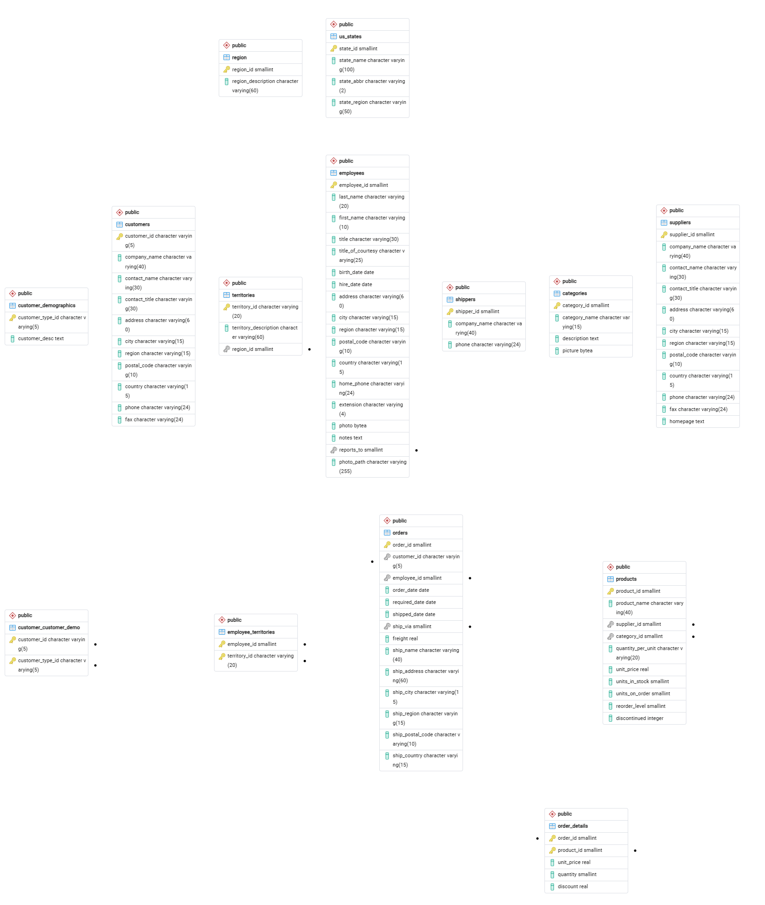

# Práctica: Análisis de Datos con Northwind
**Autor:** Adrián Vivar Moreno

## Entorno de Trabajo
* **Motor de base de datos:** PostgreSQL 18
* **Cliente gráfico:** pgAdmin 4

## Instrucciones de Reproducción

Para desplegar la base de datos y ejecutar las consultas, sigue estos pasos:

### 1. Creación de la base de datos
Es fundamental crear la base de datos forzando la codificación UTF-8 para evitar problemas con los caracteres especiales del dataset. 

Desde el Query Tool de pgAdmin (conectado a `postgres`), ejecuta:
```sql
CREATE DATABASE northwind
    WITH ENCODING  = 'UTF8'
         TEMPLATE  = template0;
```

### 2. Carga del script de datos
1. Selecciona la base de datos `northwind` recién creada en el árbol de la izquierda.
2. Abre un nuevo Query Tool (verifica que la conexión indica `northwind/postgres@PostgreSQL 18`).
3. Abre el archivo `northwind.sql` y ejecútalo (F5 o botón ▶).

*Alternativa por consola:*
```cmd
chcp 65001
psql -U postgres -d northwind -f C:\ruta\a\tu\archivo\northwind.sql
```

## Diagrama Entidad-Relación
A continuación se muestra el modelo relacional generado mediante ingeniería inversa desde pgAdmin tras la carga de datos:


 

## Índice de Contenidos
* [Resolución de las 20 consultas de análisis (respuestas.md)](respuestas.md)