# Sección 1. Fundamentos: filtrado y agregación

## Pregunta 1 — Catálogo comercial activo

**Enunciado:** Obtén los productos que **no** están descatalogados y cuyo precio unitario esté entre 10 y 50 euros, ambos incluidos. Muestra el nombre del producto y su precio redondeado a dos decimales, ordenado de mayor a menor precio.

**Consulta:**

```sql
-- Productos no descatalogados con precio entre 10 y 50 ordenados descendentemente
SELECT product_name, ROUND(unit_price::numeric, 2)
FROM products
WHERE (unit_price::numeric BETWEEN 10 AND 50)
AND discontinued = 0
ORDER BY unit_price::numeric DESC
```

**Resultado:**


**Comentario:** He usado 2 filtros en la clausula WHERE, uno para el precio y otro para incluir solo los productos activos. Por ello he envuelto en parénteis la primera condicion para clarificar la consulta. Por último he ordenado descendentemente para que los productos más caros aparezcan arriba

## Pregunta 2 — Concentración geográfica de la cartera

**Enunciado:** Cuenta cuántos clientes hay en cada país y muestra únicamente aquellos países con 5 o más clientes, ordenados de mayor a menor. Indica también cuántas ciudades distintas hay en cada uno de esos países.
**Consulta:**

```sql
-- Países con 5 o más clientes, ordenados de mayor a menor descendentemente, y cuántas ciudades hay en ellos
SELECT country AS pais, COUNT(customer_id) AS num_clientes, COUNT(DISTINCT city)
FROM customers
AS num_ciudades
GROUP BY country
HAVING(COUNT(customer_id)) > 5
ORDER BY COUNT(customer_id) DESC
```

**Resultado:**


**Comentario:** Comentario: He agrupado los datos por país para poder calcular dos cosas: cuántos clientes hay y cuántas ciudades únicas (usando DISTINCT) existen en cada uno. Después, en lugar de usar WHERE, he utilizado la cláusula HAVING porque estoy filtrando sobre un cálculo (el recuento de clientes) para quedarme solo con los países que tienen más de 5 clientes. Por último, he ordenado los resultados de forma descendente para que los países con mayor cantidad de clientes aparezcan arriba del todo.

## Pregunta 3 — Alerta de reposición

**Enunciado:** Localiza los productos activos cuyas unidades en stock sean inferiores o iguales a su nivel de reposición. Muestra el nombre, las unidades en stock, el nivel de reposición, las unidades ya pedidas al proveedor y una columna de texto que indique 'CRÍTICO' cuando el stock sea 0 y 'AVISO' en el resto de casos.
**Consulta:**

```sql
-- -- Productos activos con stock igual o inferior a su nivel de reposición, detallando unidades y estado de alerta ('CRÍTICO' o 'AVISO')
SELECT product_name AS producto,
	units_in_stock AS stock,
	reorder_level AS nivel_reposicion,
	units_on_order AS pedido_a_proveedor,
	CASE WHEN units_in_stock = 0 THEN 'CRÍTICO'
	ELSE 'AVISO'
	END AS situacion
FROM products
WHERE 
(discontinued = 0 AND units_in_stock <= reorder_level)
```

**Resultado:**

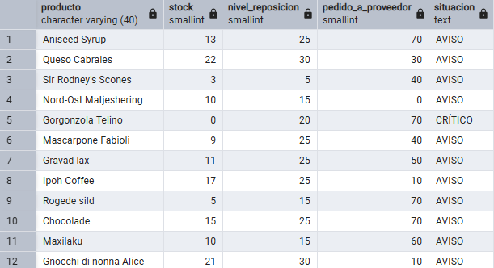

**Comentario:** He filtrado en el WHERE los productos activos con el stock al límite o por debajo del nivel de reposición. Además, he utilizado una estructura CASE para generar la nueva columna de alerta, marcando 'CRÍTICO' si el stock es 0 y 'AVISO' en el resto de casos.

# Sección 2. INNER JOIN

## Pregunta 4 — Ficha completa de producto

**Enunciado:** Para los productos suministrados por empresas de Italia, Francia o España, muestra el nombre del producto, el nombre de la categoría, el nombre del proveedor, su país y su ciudad. Ordena por país y, dentro de cada país, por nombre de producto.
**Consulta:**

```sql
-- -- Productos de proveedores en Italia, Francia o España con su categoría y origen, ordenados por país y producto
SELECT p.product_name AS producto,
c.category_name AS categoria,
s.company_name AS proveedor,
s.country AS pais,
s.city AS ciudad
FROM products p
INNER JOIN categories AS C
USING (category_id)
INNER JOIN suppliers AS s
USING (supplier_id)
WHERE s.country IN('Italy', 'France', 'Spain')
ORDER BY pais, producto
```
**Resultado:**


**Comentario:** He unido las tres tablas mediante INNER JOIN utilizando la sintaxis USING, lo que simplifica el código al tener el mismo nombre de ID en ambas tablas. Después, usé IN para filtrar los tres países a la vez de forma limpia, y ordené los resultados aprovechando los propios alias definidos en el SELECT

## Pregunta 5 — Detalle valorizado de un pedido

**Enunciado:** Muestra, para ese pedido, el nombre del producto, el precio unitario aplicado, la cantidad, el descuento y el importe final de cada línea. Añade el nombre del cliente y la fecha del pedido.
**Consulta:**

```sql
-- -- Desglose de un pedido específico con cliente, fecha, productos y cálculo del importe final por línea
SELECT
c.company_name AS cliente,
o.order_date AS fecha_pedido,
p.product_name AS product,
ROUND((od.unit_price::numeric) * quantity * (1 - od.discount::numeric), 2) AS precio_unitario,
od.quantity AS cantidad,
od.discount AS descuento
FROM customers c
INNER JOIN orders o
USING(customer_id)
INNER JOIN order_details od
USING(order_id)
INNER JOIN products p
USING(product_id)
WHERE o.order_id = 10248
```
**Resultado:**

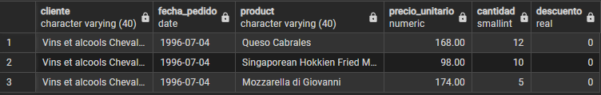

**Comentario:** He enlazado las cuatro tablas necesarias mediante INNER JOIN utilizando la cláusula USING, aprovechando que las columnas clave se llaman igual en todas ellas. Para calcular el importe final de cada línea, he multiplicado el precio por la cantidad aplicándole el descuento, y he utilizado ::numeric junto con ROUND() para asegurar que el resultado quede limpio con dos decimales. Por último, he filtrado con WHERE para mostrar únicamente los datos del pedido 10248.

## Pregunta 6 — Ranking de categorías por facturación

**Enunciado:** Calcula la facturación total de cada categoría durante toda la historia de la compañía. Muestra el nombre de la categoría, el número de líneas de pedido que ha generado, el número de productos distintos vendidos y la facturación total. Incluye únicamente las categorías que superen los 100.000 euros de facturación, ordenadas de mayor a menor.
**Consulta:**

```sql
--- --- Facturación histórica, líneas de pedido y productos distintos por categoría (solo superiores a 100.000€), ordenado de mayor a menor
SELECT
c.category_name AS categoria,
COUNT(DISTINCT o.order_id) AS num_lineas,
COUNT(DISTINCT p.product_id) AS num_productos,
SUM(ROUND((od.unit_price::numeric) * quantity * (1 - od.discount::numeric), 2)) AS facturacion
FROM categories c
INNER JOIN products p
USING(category_id)
INNER JOIN order_details od
USING(product_id)
INNER JOIN orders o
USING(order_id)
GROUP BY c.category_name
HAVING SUM(ROUND((od.unit_price::numeric) * quantity * (1 - od.discount::numeric), 2)) > 100000
ORDER BY facturacion DESC
```
**Resultado:**

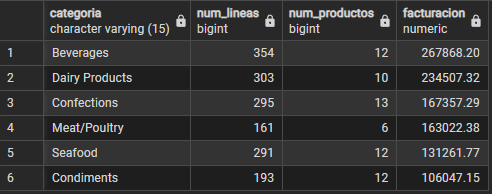

**Comentario:**  He unido las cuatro tablas con INNER JOIN y la sintaxis USING, agrupando después los resultados por categoría. He utilizado COUNT(DISTINCT) para asegurar que cuento pedidos y productos únicos, y he calculado la facturación total multiplicando precio por cantidad menos descuento, casteando a numeric y redondeando a dos decimales. Finalmente, usé HAVING para filtrar solo aquellas categorías cuya suma supera los 100.000, y ordené el resultado de mayor a menor facturación. 

# Sección 3. Uniones externas, reflexivas y cruzadas

## Pregunta 7 — Clientes sin actividad comercial

**Enunciado:** Lista todos los clientes con el número de pedidos que ha realizado cada uno y la fecha de su último pedido. Los clientes sin ningún pedido deben aparecer igualmente, con un 0 en el conteo y el texto 'SIN PEDIDOS' en lugar de la fecha. Ordena de forma que los clientes inactivos aparezcan primero.
**Consulta:**

```sql
--- --- Todos los clientes con su total de pedidos y fecha del último, incluyendo inactivos ('SIN PEDIDOS') mostrados al principio
SELECT 
c.company_name AS cliente,
c.country AS pais,
COUNT(o.order_id) AS num_pedidos,
COALESCE(CAST(MAX(order_date) AS VARCHAR),'SIN PEDIDOS') AS ultimo_pedido
FROM customers c
LEFT JOIN orders o
USING(customer_id)
GROUP BY c.company_name, c.country
ORDER BY num_pedidos
```
**Resultado:**

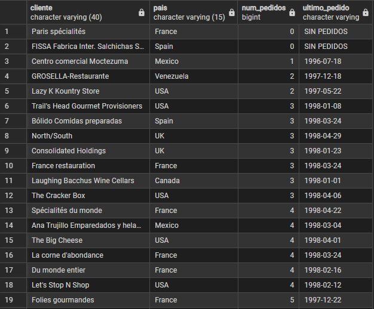

**Comentario:** He utilizado un `LEFT JOIN` para incluir a todos los clientes, tengan pedidos o no, y he agrupado por cliente y país. Usé `COUNT` para obtener el total de pedidos (que devuelve 0 si no hay) y `MAX` para extraer la fecha de compra más reciente. Esta fecha la he convertido a texto con `CAST` y la he envuelto en un `COALESCE` para mostrar 'SIN PEDIDOS' en caso de ser nula. Finalmente, ordené por el número de pedidos para dejar a los inactivos al principio.

## Pregunta 8 — Organigrama de la fuerza de ventas

**Enunciado:** Muestra cada empleado con su nombre completo, su cargo, el nombre completo de la persona a la que reporta y el cargo de esa persona. El empleado que no reporta a nadie debe aparecer también, con el texto 'DIRECCIÓN GENERAL' en el campo del responsable.
**Consulta:**

```sql
--- --- Empleados con su cargo y los datos de su responsable directo, indicando 'DIRECCIÓN GENERAL' si no tienen superior
SELECT
CONCAT(emp.first_name, ' ', emp.last_name) AS empleado,
emp.title AS cargo,
COALESCE(CONCAT(jefe.first_name, ' ', jefe.last_name), 'DIRECCIÓN GENERAL') AS responsable,
jefe.title AS cargo_responsable
FROM employees emp
LEFT JOIN employees jefe
ON emp.reports_to=jefe.employee_id
```
**Resultado:**

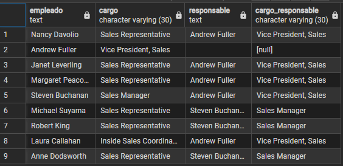

**Comentario:** He realizado un *self-join* (uniendo la tabla `employees` consigo misma) mediante un `LEFT JOIN` para asegurar que el empleado que no tiene jefe no desaparezca de la lista. He utilizado la función `CONCAT` para unir el nombre y apellido en una sola columna, y he aplicado un `COALESCE` para detectar al empleado que no reporta a nadie y sustituir el valor nulo por el literal 'DIRECCIÓN GENERAL'.

## Pregunta 9 — Rejilla de cobertura categoría × año

**Enunciado:** Genera todas las combinaciones posibles de las 8 categorías con los 3 años del histórico (24 filas) y asocia a cada combinación su facturación. Ordena por categoría y año.
**Consulta:**

```sql
--- --- Todas las combinaciones posibles de categorías y años con su respectiva facturación, ordenado por categoría y año
-- Matriz completa de facturación por categoría y año sin pérdida de combinaciones
SELECT 
    c.category_name AS categoria,
    y.anio,
    COALESCE(ROUND(SUM(d.unit_price::numeric * d.quantity * (1 - d.discount::numeric)), 2), 0) AS facturacion
FROM categories c
CROSS JOIN (
    SELECT DISTINCT EXTRACT(YEAR FROM order_date)::int AS anio 
    FROM orders
) y
LEFT JOIN products p ON c.category_id = p.category_id
LEFT JOIN order_details d ON p.product_id = d.product_id
LEFT JOIN orders o ON d.order_id = o.order_id AND EXTRACT(YEAR FROM o.order_date) = y.anio
GROUP BY c.category_name, y.anio
ORDER BY 1, 2;

```
**Resultado:**

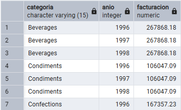

**Comentario:** He utilizado un `CROSS JOIN` para cruzar todas las categorías y años, asegurando que aparezcan en el reporte tengan ventas o no. Luego, usé `LEFT JOIN` para enlazar los detalles de los pedidos. Apliqué `SUM` y `ROUND` para calcular la facturación teniendo en cuenta el descuento, y lo envolví en un `COALESCE` para devolver 0 en caso de ser nula. Finalmente, agrupé y ordené por categoría y año.

## Pregunta 10 — Mapa de países: clientes frente a proveedores

**Enunciado:** Expansión internacional quiere una única tabla que muestre, para cada país en el que la compañía tiene presencia, cuántos clientes y cuántos proveedores hay. Deben aparecer los países que solo tienen clientes, los que solo tienen proveedores y los que tienen ambos.
**Consulta:**

```sql
--- --- Número de clientes y proveedores por país, incluyendo aquellos donde solo existe uno de los dos
SELECT 
    COALESCE(c.country, s.country) AS pais,
    COUNT(DISTINCT c.customer_id) AS num_clientes,
    COUNT(DISTINCT s.supplier_id) AS num_proveedores,
    CASE 
        WHEN COUNT(DISTINCT c.customer_id) > 0 AND COUNT(DISTINCT s.supplier_id) > 0 THEN 'AMBOS'
        WHEN COUNT(DISTINCT c.customer_id) > 0 THEN 'SOLO CLIENTES'
        ELSE 'SOLO PROVEEDORES'
    END AS tipo_presencia
FROM customers c
FULL JOIN suppliers s 
    ON c.country = s.country
GROUP BY 
    COALESCE(c.country, s.country)
ORDER BY 
    pais;
```
**Resultado:**


**Comentario:** He utilizado un `FULL JOIN` entre las tablas de clientes y proveedores cruzándolas por el país, lo que garantiza que no se pierda ningún territorio. Agrupé los resultados utilizando un `COALESCE` sobre el país para unificar ambos orígenes y calculé los totales con `COUNT(DISTINCT)`. Además, he incorporado una estructura `CASE` para clasificar el tipo de presencia comercial según existan clientes, proveedores o ambos, ordenando finalmente el listado por país.axis USING, lo que simplifica **Comentario:** He utilizado un `FULL JOIN` entre las tablas de clientes y proveedores cruzándolas por el país, lo que garantiza que no se pierda ningún territorio. Agrupé los resultados utilizando un `COALESCE` sobre el país para unificar ambos orígenes y calculé los totales con `COUNT(DISTINCT)`. Además, he incorporado una estructura `CASE` para clasificar el tipo de presencia comercial según existan clientes, proveedores o ambos, ordenando finalmente el listado por país.

## Pregunta 11 — Directorio unificado de contactos

**Enunciado:** Construye una sola tabla que reúna los contactos de clientes, los de proveedores y los empleados. Cada fila debe indicar el origen ('CLIENTE', 'PROVEEDOR', 'EMPLEADO'), el nombre de la persona de contacto en mayúsculas, la organización a la que pertenece, la ciudad y el país. Para los empleados, la organización es el literal 'NORTHWIND TRADERS' y el nombre de contacto se forma concatenando nombre y apellidos.
**Consulta:**

```sql
-- Directorio unificado de contactos (clientes, proveedores y empleados) con organización y ubicación
SELECT 
    'CLIENTE' AS origen,
    UPPER(c.contact_name) AS contacto,
    c.company_name AS organizacion,
    c.city AS ciudad,
    c.country AS pais
FROM customers c

UNION ALL

SELECT 
    'PROVEEDOR' AS origen,
    UPPER(s.contact_name) AS contacto,
    s.company_name AS organizacion,
    s.city AS ciudad,
    s.country AS pais
FROM suppliers s

UNION ALL
SELECT 
    'EMPLEADO' AS origen,
    UPPER(e.first_name || ' ' || e.last_name) AS contacto,
    'Northwind Traders' AS organizacion,
    e.city AS ciudad,
    e.country AS pais
FROM employees e
ORDER BY 1, 5;
```
**Resultado:**

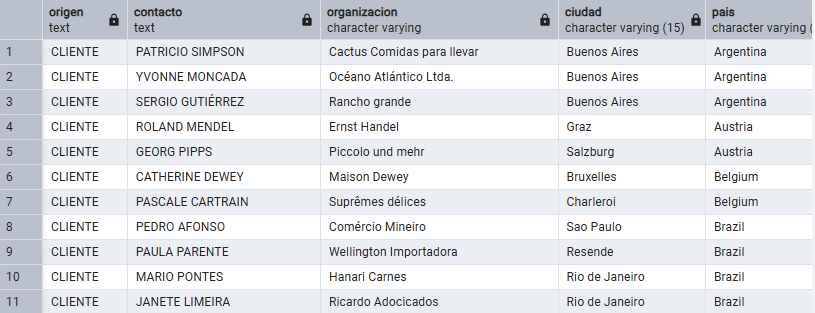

**Comentario:** He utilizado `UNION ALL` para combinar los registros de clientes, proveedores y empleados en un único listado con columnas estandarizadas. Usé `UPPER` para transformar los nombres de contacto a mayúsculas, concatenando nombre y apellido en los empleados. Finalmente, ordené por origen y país para agrupar la información.

## Pregunta 12 — Mercados con desequilibrio

**Enunciado:** Construye una sola tabla que reúna los contactos de clientes, los de proveedores y los empleados. Cada fila debe indicar el origen ('CLIENTE', 'PROVEEDOR', 'EMPLEADO'), el nombre de la persona de contacto en mayúsculas, la organización a la que pertenece, la ciudad y el país. Para los empleados, la organización es el literal 'NORTHWIND TRADERS' y el nombre de contacto se forma concatenando nombre y apellidos.
**Consulta:**

```sql
-- Análisis de presencia geográfica: Países exclusivos de clientes y países compartidos con proveedores
SELECT c.country AS pais 
FROM customers c
EXCEPT
SELECT s.country 
FROM suppliers s
ORDER BY 1;

-- Países donde coinciden clientes y proveedores
SELECT c.country AS pais 
FROM customers c
INTERSECT
SELECT s.country 
FROM suppliers s
ORDER BY 1;
```
**Resultado:**

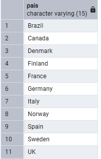

**Comentario:** He utilizado `EXCEPT` para obtener los países que tienen clientes pero no proveedores, y por otro lado, `INTERSECT` para listar aquellos países donde coinciden ambos. Finalmente, ordené los resultados de ambas consultas alfabéticamente por país.

## Pregunta 13 — Clientes que nunca han comprado pescado
**Enunciado:** Localiza los clientes que nunca han incluido un producto de la categoría 'Seafood' en ninguno de sus pedidos. Muestra el nombre del cliente, su país y el número total de pedidos que sí ha realizado, de mayor a menor.
**Consulta:**

```sql
-- Análisis de presencia geográfica: Países exclusivos de clientes y países compartidos con proveedores
-- Clientes que no compran Seafood y cuántos pedidos tienen
SELECT 
    c.company_name AS cliente,
    c.country AS pais,
    COUNT(o.order_id) AS pedidos_realizados
FROM customers c
LEFT JOIN orders o ON c.customer_id = o.customer_id
WHERE NOT EXISTS (
    SELECT 1
    FROM orders o2
    JOIN order_details d ON o2.order_id = d.order_id
    JOIN products p ON d.product_id = p.product_id
    JOIN categories cg ON p.category_id = cg.category_id
    WHERE o2.customer_id = c.customer_id
      AND cg.category_name = 'Seafood'
)
GROUP BY c.company_name, c.country
ORDER BY 3 DESC;
```
**Resultado:**

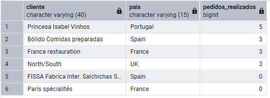

**Comentario:** He utilizado `WHERE NOT EXISTS` apoyado en una subconsulta para filtrar a los clientes que nunca han comprado productos de la categoría 'Seafood'. Además, usé `LEFT JOIN` y `COUNT` para calcular el total de pedidos realizados por cada uno. Finalmente, agrupé por cliente y país, y ordené los resultados de mayor a menor cantidad de pedidos.

## Pregunta 14 — Productos por encima de la media

**Enunciado:** Muestra los productos activos cuyo precio unitario supere el precio medio de todo el catálogo. Incluye en cada fila el precio del producto, el precio medio general y la diferencia entre ambos, todo redondeado a dos decimales. Ordena por diferencia descendente.
**Consulta:**

```sql
-- Productos activos por encima del precio medio
SELECT 
    p.product_name AS producto,
    ROUND(p.unit_price::numeric, 2) AS precio,
    ROUND((SELECT AVG(unit_price::numeric) FROM products WHERE discontinued = 0), 2) AS precio_medio_catalogo,
    ROUND(p.unit_price::numeric - (SELECT AVG(unit_price::numeric) FROM products WHERE discontinued = 0), 2) AS diferencia
FROM products p
WHERE p.discontinued = 0
  AND p.unit_price > (SELECT AVG(unit_price::numeric) FROM products WHERE discontinued = 0)
ORDER BY 4 DESC;
```
**Resultado:**

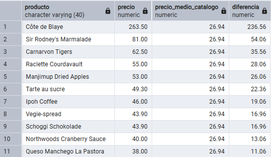

**Comentario:** He utilizado subconsultas escalares con `AVG` para obtener el precio medio de los productos activos, aplicándolas tanto en el `WHERE` para filtrar los resultados, como en el `SELECT` para mostrar la media y calcular la diferencia. Usé `ROUND` para ajustar los decimales y, finalmente, ordené los resultados de mayor a menor según su diferencia respecto a la media.

## Pregunta 15 — Ticket medio por cliente

**Enunciado:** alcula, para cada cliente que haya comprado alguna vez, el número de pedidos, el importe total acumulado y el importe medio por pedido. Muestra los 15 clientes con mayor ticket medio.

El cálculo tiene dos niveles: primero hay que obtener el importe de cada pedido sumando sus líneas, y solo después promediar esos importes por cliente. **Promediar directamente las líneas daría un resultado distinto y equivocado.**
**Consulta:**

```sql
-- Top 15 clientes con mayor ticket medio
SELECT 
    c.company_name AS cliente,
    c.country AS pais,
    COUNT(p.order_id) AS num_pedidos,
    ROUND(SUM(p.importe_pedido), 2) AS importe_total,
    ROUND(AVG(p.importe_pedido), 2) AS ticket_medio
FROM customers c
JOIN (
    SELECT 
        order_id,
        customer_id,
        SUM(unit_price::numeric * quantity * (1 - discount::numeric)) AS importe_pedido
    FROM order_details
    JOIN orders USING (order_id)
    GROUP BY 1, 2
) p ON c.customer_id = p.customer_id
GROUP BY 1, 2
ORDER BY 5 DESC
LIMIT 15;
```
**Resultado:**

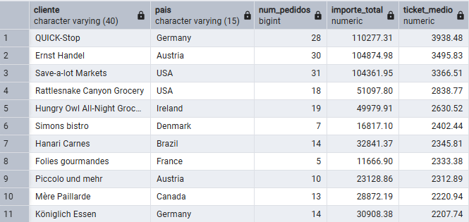

**Comentario:** He utilizado una subconsulta en el `FROM` para calcular primero el importe exacto de cada pedido aplicando sus respectivos descuentos. Luego, uní estos resultados con la tabla de clientes mediante `JOIN` para obtener el total de pedidos con `COUNT`, la facturación global con `SUM` y el ticket medio con `AVG`. Finalmente, agrupé por cliente, ordené de mayor a menor ticket medio y restringí la salida con `LIMIT 15`.

## Pregunta 16 — El producto más caro de cada categoría

**Enunciado:** Para cada categoría, muestra el producto con el precio unitario más alto. Incluye el nombre de la categoría, el nombre del producto, su precio y el precio medio de su categoría.

Resuélvelo con una **subconsulta correlacionada**: para cada producto, comprueba si su precio coincide con el máximo de su propia categoría
**Consulta:**

```sql
-- Producto más caro de cada categoría y media de su categoría
SELECT 
    c.category_name AS categoria,
    p.product_name AS producto,
    ROUND(p.unit_price::numeric, 2) AS precio,
    ROUND((
        SELECT AVG(pa.unit_price::numeric)
        FROM products pa
        WHERE pa.category_id = p.category_id
    ), 2) AS precio_medio_categoria
FROM products p
JOIN categories c ON p.category_id = c.category_id
WHERE p.unit_price = (
    SELECT MAX(pm.unit_price)
    FROM products pm
    WHERE pm.category_id = p.category_id
)
ORDER BY 1;
```
**Resultado:**

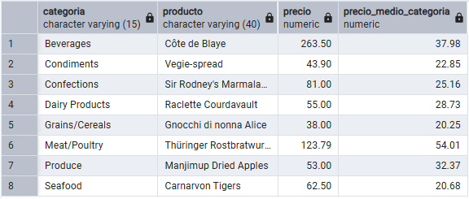

**Comentario:** He utilizado subconsultas correlacionadas tanto en el `SELECT` para calcular el precio medio (`AVG`) de cada categoría, como en el `WHERE` para filtrar exclusivamente el producto con el precio máximo (`MAX`). Usé `JOIN` para incluir el nombre de la categoría, apliqué `ROUND` para ajustar los decimales y, finalmente, ordené alfabéticamente por categoría.


## Pregunta 17 — Segmentación ABC de la cartera de clientes

**Enunciado:** Usando expresiones de tabla común (CTE), construye una consulta que:

1. Calcule la facturación total de cada cliente.
2. Divida los clientes en **cuartiles** según esa facturación.
3. Asigne una etiqueta de segmento: `'A - Estratégico'` al cuartil superior, `'B - Consolidado'` al segundo, `'C - Ocasional'` al tercero y `'D - Marginal'` al cuarto.
4. Devuelva, por segmento, el número de clientes, la facturación total del segmento y el porcentaje que representa sobre el total de la compañía.
**Consulta:**

```sql
-- Segmentación de clientes en 4 grupos según sus ventas
WITH ventas AS (
    SELECT 
        customer_id,
        SUM(unit_price::numeric * quantity * (1 - discount::numeric)) AS total
    FROM orders 
    JOIN order_details USING (order_id)
    GROUP BY 1
),
segmentos AS (
    SELECT 
        total,
        CASE NTILE(4) OVER (ORDER BY total DESC)
            WHEN 1 THEN 'A - Estratégico'
            WHEN 2 THEN 'B - Consolidado'
            WHEN 3 THEN 'C - Ocasional'
            WHEN 4 THEN 'D - Marginal'
        END AS segmento
    FROM ventas
)
SELECT 
    segmento,
    COUNT(*) AS num_clientes,
    ROUND(SUM(total), 2) AS facturacion_segmento,
    ROUND(SUM(total) / (SELECT SUM(total) FROM ventas) * 100, 2) AS porcentaje
FROM segmentos
GROUP BY 1
ORDER BY 3 DESC;
```
**Resultado:**

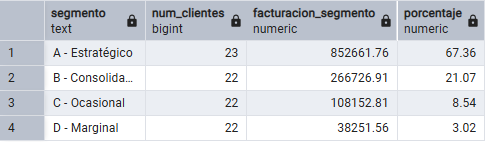

**Comentario:** He utilizado expresiones de tabla comunes (`CTE`) para estructurar la consulta calculando primero el total de ventas por cliente. Luego, usé la función de ventana `NTILE(4)` junto con un `CASE` para clasificarlos en cuatro segmentos de negocio. Finalmente, agrupé los datos para obtener el número de clientes con `COUNT`, la facturación total con `SUM` y el porcentaje de ventas global mediante una subconsulta, ordenando de mayor a menor facturación.


## Pregunta 18 — Los tres productos más vendidos de cada categoría

**Enunciado:** Para cada categoría, obtén los **tres productos con mayor facturación**. Muestra la categoría, la posición dentro de la categoría, el nombre del producto, las unidades vendidas y la facturación.

Incluye además una columna con la posición global del producto en el conjunto de la compañía, para que se vea qué productos son líderes de su nicho pero irrelevantes en el total.
**Consulta:**

```sql
-- Top 3 de ventas por categoría y su posición global
-- Top 3 de ventas por categoría y su posición global
WITH ventas AS (
    SELECT 
        p.category_id,
        p.product_name AS producto,
        SUM(d.quantity) AS unidades,
        SUM(d.unit_price::numeric * d.quantity * (1 - d.discount::numeric)) AS total
    FROM products p
    JOIN order_details d USING (product_id)
    GROUP BY 1, 2
),
rankings AS (
    SELECT 
        *,
        DENSE_RANK() OVER (PARTITION BY category_id ORDER BY total DESC) AS pos_cat,
        DENSE_RANK() OVER (ORDER BY total DESC) AS pos_global
    FROM ventas
)
SELECT 
    c.category_name AS categoria,
    r.pos_cat AS posicion_en_categoria,
    r.producto,
    r.unidades,
    ROUND(r.total, 2) AS facturacion,
    r.pos_global
FROM rankings r
JOIN categories c USING (category_id)
WHERE r.pos_cat <= 3
ORDER BY 1, 2;
```
**Resultado:**

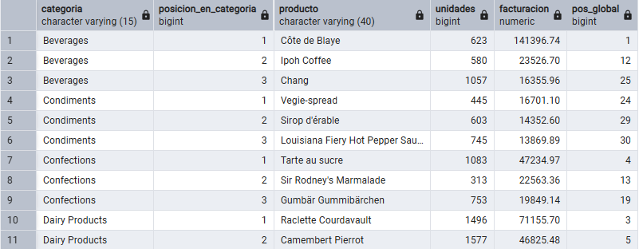

**Comentario:** He utilizado expresiones de tabla comunes (`CTE`) para estructurar la consulta, calculando primero la facturación total por producto. Luego, usé la función de ventana `DENSE_RANK()` para asignar un ranking de ventas tanto a nivel interno de la categoría (usando `PARTITION BY`) como a nivel global. Finalmente, uní los resultados con las categorías, filtré con `WHERE` para mostrar únicamente el top 3 de cada una, apliqué `ROUND` a los importes y ordené la salida por categoría y posición.


## Pregunta 19 — Evolución mensual con acumulado y media móvil

**Enunciado:** Para cada mes de 1997, calcula:

- La facturación del mes.
- El total acumulado desde enero.
- La media móvil de los tres últimos meses (el mes actual y los dos anteriores).
- La facturación del mes anterior.
- La variación porcentual respecto al mes anterior.


**Consulta:**

```sql
-- Evolución mensual de ventas en 1997 (Acumulado, Media móvil y MoM)
WITH ventas_97 AS (
    SELECT 
        DATE_TRUNC('month', order_date)::date AS mes,
        SUM(d.unit_price::numeric * d.quantity * (1 - d.discount::numeric)) AS total
    FROM orders o
    JOIN order_details d USING (order_id)
    WHERE order_date >= '1997-01-01' AND order_date < '1998-01-01'
    GROUP BY 1
)
SELECT 
    mes,
    ROUND(total, 2) AS facturacion,
    ROUND(SUM(total) OVER (ORDER BY mes), 2) AS acumulado,
    ROUND(AVG(total) OVER (ORDER BY mes ROWS BETWEEN 2 PRECEDING AND CURRENT ROW), 2) AS media_movil_3m,
    ROUND(LAG(total) OVER (ORDER BY mes), 2) AS mes_anterior,
    ROUND((total / LAG(total) OVER (ORDER BY mes) - 1) * 100, 2) AS variacion_pct
FROM ventas_97
ORDER BY 1;
```
**Resultado:**

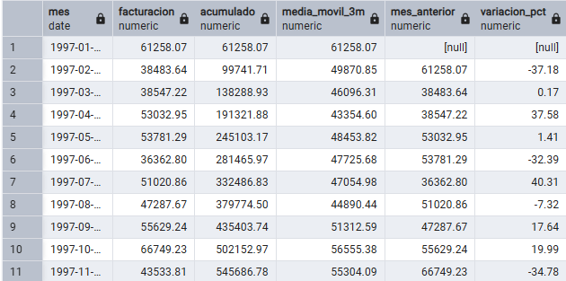

**Comentario:** He utilizado una `CTE` para agrupar las ventas mensuales de 1997 mediante `DATE_TRUNC`. Luego, apliqué diversas funciones de ventana (`OVER`) para calcular métricas temporales: `SUM` para el acumulado anual, `AVG` con `ROWS BETWEEN` para la media móvil de 3 meses, y `LAG` para obtener la facturación del mes anterior y calcular su variación porcentual. Finalmente, ajusté los decimales con `ROUND` y ordené los resultados cronológicamente.

## Pregunta 20 — Cuadro de mando anual por categoría
**Enunciado:** Construye una tabla donde cada fila sea una categoría y las columnas muestren la facturación de 1996, 1997 y 1998 en columnas separadas, más el total de los tres años. Añade al final una fila de totales generales.

Incluye además una columna que indique el peso de cada categoría sobre la facturación total de la compañía, y otra que muestre si la categoría creció o decreció entre 1997 y 1998.


**Consulta:**

```sql
-- Ventas anuales por categoría (Pivot) y % sobre el total
-- Ojo: 1996 y 1998 son años incompletos, la tendencia 97-98 tiene trampa.
-- Ventas anuales por categoría (Pivot). Ojo: 1996 y 1998 incompletos.
WITH detalle AS (
    SELECT 
        c.category_name,
        EXTRACT(YEAR FROM o.order_date) AS anio,
        d.unit_price::numeric * d.quantity * (1 - d.discount::numeric) AS importe
    FROM categories c
    JOIN products USING (category_id)
    JOIN order_details d USING (product_id)
    JOIN orders o USING (order_id)
),
pivot_ventas AS (
    SELECT 
        category_name,
        SUM(importe) FILTER (WHERE anio = 1996) AS f_96,
        SUM(importe) FILTER (WHERE anio = 1997) AS f_97,
        SUM(importe) FILTER (WHERE anio = 1998) AS f_98,
        SUM(importe) AS total
    FROM detalle
    GROUP BY ROLLUP(category_name)
)
SELECT 
    COALESCE(category_name, 'Total General') AS categoria,
    COALESCE(ROUND(f_96, 2), 0) AS f_1996,
    COALESCE(ROUND(f_97, 2), 0) AS f_1997,
    COALESCE(ROUND(f_98, 2), 0) AS f_1998,
    ROUND(total, 2) AS total,
    ROUND(total / (SELECT total FROM pivot_ventas WHERE category_name IS NULL) * 100, 2) AS pct,
    CASE 
        WHEN category_name IS NULL THEN '-'
        WHEN f_98 > f_97 THEN 'Crece'
        ELSE 'Decrece'
    END AS tendencia
FROM pivot_ventas
ORDER BY (category_name IS NULL), 5 DESC;
```
**Resultado:**

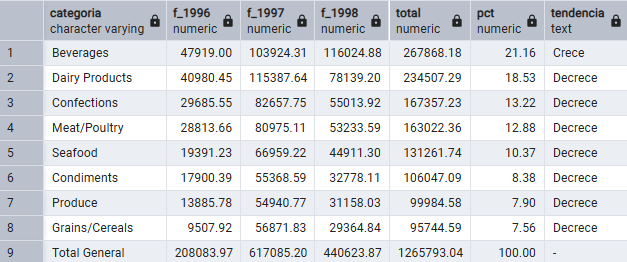

**Comentario:** He utilizado expresiones de tabla comunes (`CTE`) para preparar los importes y la cláusula `FILTER` junto con `SUM` para pivotar los datos en columnas anuales. Usé `ROLLUP` para generar automáticamente una fila de total general, manejando sus valores nulos con `COALESCE`. Finalmente, integré una subconsulta para calcular el peso porcentual sobre el total y un `CASE` para evaluar la tendencia, ordenando los resultados para mantener la fila de totales al final.