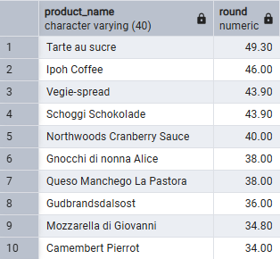
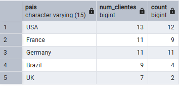
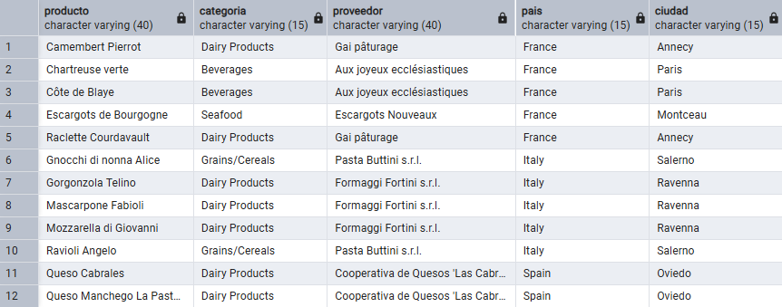

# Sección 1. Fundamentos: filtrado y agregación

## Pregunta 1 — Catálogo comercial activo

**Enunciado:** Obtén los productos que **no** están descatalogados y cuyo precio unitario esté entre 10 y 50 euros, ambos incluidos. Muestra el nombre del producto y su precio redondeado a dos decimales, ordenado de mayor a menor precio.

**Consulta:**

```sql
-- Productos no descatalogados con precio entre 10 y 50 ordenados descendentemente
SELECT product_name, ROUND(unit_price::numeric, 2)
FROM products
WHERE (unit_price::numeric BETWEEN 10 AND 50)
AND discontinued = 0
ORDER BY unit_price::numeric DESC
```

**Resultado:**



**Comentario:** He usado 2 filtros en la clausula WHERE, uno para el precio y otro para incluir solo los productos activos. Por ello he envuelto en parénteis la primera condicion para clarificar la consulta. Por último he ordenado descendentemente para que los productos más caros aparezcan arriba

## Pregunta 2 — Concentración geográfica de la cartera

**Enunciado:** Cuenta cuántos clientes hay en cada país y muestra únicamente aquellos países con 5 o más clientes, ordenados de mayor a menor. Indica también cuántas ciudades distintas hay en cada uno de esos países.
**Consulta:**

```sql
-- Países con 5 o más clientes, ordenados de mayor a menor descendentemente, y cuántas ciudades hay en ellos
SELECT country AS pais, COUNT(customer_id) AS num_clientes, COUNT(DISTINCT city)
FROM customers
AS num_ciudades
GROUP BY country
HAVING(COUNT(customer_id)) > 5
ORDER BY COUNT(customer_id) DESC
```

**Resultado:**



**Comentario:** Comentario: He agrupado los datos por país para poder calcular dos cosas: cuántos clientes hay y cuántas ciudades únicas (usando DISTINCT) existen en cada uno. Después, en lugar de usar WHERE, he utilizado la cláusula HAVING porque estoy filtrando sobre un cálculo (el recuento de clientes) para quedarme solo con los países que tienen más de 5 clientes. Por último, he ordenado los resultados de forma descendente para que los países con mayor cantidad de clientes aparezcan arriba del todo.

## Pregunta 3 — Alerta de reposición

**Enunciado:** Localiza los productos activos cuyas unidades en stock sean inferiores o iguales a su nivel de reposición. Muestra el nombre, las unidades en stock, el nivel de reposición, las unidades ya pedidas al proveedor y una columna de texto que indique 'CRÍTICO' cuando el stock sea 0 y 'AVISO' en el resto de casos.
**Consulta:**

```sql
-- -- Productos activos con stock igual o inferior a su nivel de reposición, detallando unidades y estado de alerta ('CRÍTICO' o 'AVISO')
SELECT product_name AS producto,
	units_in_stock AS stock,
	reorder_level AS nivel_reposicion,
	units_on_order AS pedido_a_proveedor,
	CASE WHEN units_in_stock = 0 THEN 'CRÍTICO'
	ELSE 'AVISO'
	END AS situacion
FROM products
WHERE 
(discontinued = 0 AND units_in_stock <= reorder_level)
```

**Resultado:**


**Comentario:** He filtrado en el WHERE los productos activos con el stock al límite o por debajo del nivel de reposición. Además, he utilizado una estructura CASE para generar la nueva columna de alerta, marcando 'CRÍTICO' si el stock es 0 y 'AVISO' en el resto de casos.

# Sección 2. INNER JOIN

## Pregunta 4 — Ficha completa de producto

**Enunciado:** Para los productos suministrados por empresas de Italia, Francia o España, muestra el nombre del producto, el nombre de la categoría, el nombre del proveedor, su país y su ciudad. Ordena por país y, dentro de cada país, por nombre de producto.
**Consulta:**

```sql
-- -- Productos de proveedores en Italia, Francia o España con su categoría y origen, ordenados por país y producto
SELECT p.product_name AS producto,
c.category_name AS categoria,
s.company_name AS proveedor,
s.country AS pais,
s.city AS ciudad
FROM products p
INNER JOIN categories AS C
USING (category_id)
INNER JOIN suppliers AS s
USING (supplier_id)
WHERE s.country IN('Italy', 'France', 'Spain')
ORDER BY pais, producto
```
**Resultado:**



**Comentario:** He unido las tres tablas mediante INNER JOIN utilizando la sintaxis USING, lo que simplifica el código al tener el mismo nombre de ID en ambas tablas. Después, usé IN para filtrar los tres países a la vez de forma limpia, y ordené los resultados aprovechando los propios alias definidos en el SELECT

## Pregunta 5 — Detalle valorizado de un pedido

**Enunciado:** Muestra, para ese pedido, el nombre del producto, el precio unitario aplicado, la cantidad, el descuento y el importe final de cada línea. Añade el nombre del cliente y la fecha del pedido.
**Consulta:**

```sql
-- -- Desglose de un pedido específico con cliente, fecha, productos y cálculo del importe final por línea
SELECT
c.company_name AS cliente,
o.order_date AS fecha_pedido,
p.product_name AS product,
ROUND((od.unit_price::numeric) * quantity * (1 - od.discount::numeric), 2) AS precio_unitario,
od.quantity AS cantidad,
od.discount AS descuento
FROM customers c
INNER JOIN orders o
USING(customer_id)
INNER JOIN order_details od
USING(order_id)
INNER JOIN products p
USING(product_id)
WHERE o.order_id = 10248
```
**Resultado:**


**Comentario:** He enlazado las cuatro tablas necesarias mediante INNER JOIN utilizando la cláusula USING, aprovechando que las columnas clave se llaman igual en todas ellas. Para calcular el importe final de cada línea, he multiplicado el precio por la cantidad aplicándole el descuento, y he utilizado ::numeric junto con ROUND() para asegurar que el resultado quede limpio con dos decimales. Por último, he filtrado con WHERE para mostrar únicamente los datos del pedido 10248.

## Pregunta 6 — Ranking de categorías por facturación

**Enunciado:** Calcula la facturación total de cada categoría durante toda la historia de la compañía. Muestra el nombre de la categoría, el número de líneas de pedido que ha generado, el número de productos distintos vendidos y la facturación total. Incluye únicamente las categorías que superen los 100.000 euros de facturación, ordenadas de mayor a menor.
**Consulta:**

```sql
--- --- Facturación histórica, líneas de pedido y productos distintos por categoría (solo superiores a 100.000€), ordenado de mayor a menor
SELECT
c.category_name AS categoria,
COUNT(DISTINCT o.order_id) AS num_lineas,
COUNT(DISTINCT p.product_id) AS num_productos,
SUM(ROUND((od.unit_price::numeric) * quantity * (1 - od.discount::numeric), 2)) AS facturacion
FROM categories c
INNER JOIN products p
USING(category_id)
INNER JOIN order_details od
USING(product_id)
INNER JOIN orders o
USING(order_id)
GROUP BY c.category_name
HAVING SUM(ROUND((od.unit_price::numeric) * quantity * (1 - od.discount::numeric), 2)) > 100000
ORDER BY facturacion DESC
```
**Resultado:**


**Comentario:**  He unido las cuatro tablas con INNER JOIN y la sintaxis USING, agrupando después los resultados por categoría. He utilizado COUNT(DISTINCT) para asegurar que cuento pedidos y productos únicos, y he calculado la facturación total multiplicando precio por cantidad menos descuento, casteando a numeric y redondeando a dos decimales. Finalmente, usé HAVING para filtrar solo aquellas categorías cuya suma supera los 100.000, y ordené el resultado de mayor a menor facturación. 

# Sección 3. Uniones externas, reflexivas y cruzadas

## Pregunta 7 — Clientes sin actividad comercial

**Enunciado:** Lista todos los clientes con el número de pedidos que ha realizado cada uno y la fecha de su último pedido. Los clientes sin ningún pedido deben aparecer igualmente, con un 0 en el conteo y el texto 'SIN PEDIDOS' en lugar de la fecha. Ordena de forma que los clientes inactivos aparezcan primero.
**Consulta:**

```sql
--- --- Todos los clientes con su total de pedidos y fecha del último, incluyendo inactivos ('SIN PEDIDOS') mostrados al principio
SELECT p.product_name AS producto,
c.category_name AS categoria,
s.company_name AS proveedor,
s.country AS pais,
s.city AS ciudad
FROM products p
```
**Resultado:**


**Comentario:** He unido las tres tablas mediante INNER JOIN utilizando la sintaxis USING, lo que simplifica el código al tener el mismo nombre de ID en ambas tablas. Después, usé IN para 

## Pregunta 8 — Organigrama de la fuerza de ventas

**Enunciado:** Muestra cada empleado con su nombre completo, su cargo, el nombre completo de la persona a la que reporta y el cargo de esa persona. El empleado que no reporta a nadie debe aparecer también, con el texto 'DIRECCIÓN GENERAL' en el campo del responsable.
**Consulta:**

```sql
--- --- Empleados con su cargo y los datos de su responsable directo, indicando 'DIRECCIÓN GENERAL' si no tienen superior
SELECT p.product_name AS producto,
c.category_name AS categoria,
s.company_name AS proveedor,
s.country AS pais,
s.city AS ciudad
FROM products p
```
**Resultado:**


**Comentario:** He unido las tres tablas mediante INNER JOIN utilizando la sintaxis USING, lo que simplifica el código al tener el mismo nombre de ID en ambas tablas. Después, usé IN para 

## Pregunta 9 — Rejilla de cobertura categoría × año

**Enunciado:** Genera todas las combinaciones posibles de las 8 categorías con los 3 años del histórico (24 filas) y asocia a cada combinación su facturación. Ordena por categoría y año.
**Consulta:**

```sql
--- --- Todas las combinaciones posibles de categorías y años con su respectiva facturación, ordenado por categoría y año
SELECT p.product_name AS producto,
c.category_name AS categoria,
s.company_name AS proveedor,
s.country AS pais,
s.city AS ciudad
FROM products p
```
**Resultado:**


**Comentario:** He unido las tres tablas mediante INNER JOIN utilizando la sintaxis USING, lo que simplifica el código al tener el mismo nombre de ID en ambas tablas. Después, usé IN para 

## Pregunta 10 — Mapa de países: clientes frente a proveedores

**Enunciado:** Expansión internacional quiere una única tabla que muestre, para cada país en el que la compañía tiene presencia, cuántos clientes y cuántos proveedores hay. Deben aparecer los países que solo tienen clientes, los que solo tienen proveedores y los que tienen ambos.
**Consulta:**

```sql
--- --- Número de clientes y proveedores por país, incluyendo aquellos donde solo existe uno de los dos
SELECT p.product_name AS producto,
c.category_name AS categoria,
s.company_name AS proveedor,
s.country AS pais,
s.city AS ciudad
FROM products p
```
**Resultado:**


**Comentario:** He unido las tres tablas mediante INNER JOIN utilizando la sintaxis USING, lo que simplifica el código al tener el mismo nombre de ID en ambas tablas. Después, usé IN para 

## Pregunta 11 — Directorio unificado de contactos

**Enunciado:** Construye una sola tabla que reúna los contactos de clientes, los de proveedores y los empleados. Cada fila debe indicar el origen ('CLIENTE', 'PROVEEDOR', 'EMPLEADO'), el nombre de la persona de contacto en mayúsculas, la organización a la que pertenece, la ciudad y el país. Para los empleados, la organización es el literal 'NORTHWIND TRADERS' y el nombre de contacto se forma concatenando nombre y apellidos.
**Consulta:**

```sql
--- --- Directorio unificado de contactos (clientes, proveedores y empleados) con organización y ubicación
SELECT p.product_name AS producto,
c.category_name AS categoria,
s.company_name AS proveedor,
s.country AS pais,
s.city AS ciudad
FROM products p
```
**Resultado:**


**Comentario:** He unido las tres tablas mediante INNER JOIN utilizando la sintaxis USING, lo que simplifica el código al tener el mismo nombre de ID en ambas tablas. Después, usé IN para 

## Pregunta 12 — Mercados con desequilibrio

**Enunciado:** Construye una sola tabla que reúna los contactos de clientes, los de proveedores y los empleados. Cada fila debe indicar el origen ('CLIENTE', 'PROVEEDOR', 'EMPLEADO'), el nombre de la persona de contacto en mayúsculas, la organización a la que pertenece, la ciudad y el país. Para los empleados, la organización es el literal 'NORTHWIND TRADERS' y el nombre de contacto se forma concatenando nombre y apellidos.
**Consulta:**

```sql
--- --- Directorio unificado de contactos (clientes, proveedores y empleados) con organización y ubicación
SELECT p.product_name AS producto,
c.category_name AS categoria,
s.company_name AS proveedor,
s.country AS pais,
s.city AS ciudad
FROM products p
```
**Resultado:**


**Comentario:** He unido las tres tablas mediante INNER JOIN utilizando la sintaxis USING, lo que simplifica el código al tener el mismo nombre de ID en ambas tablas. Después, usé IN para 